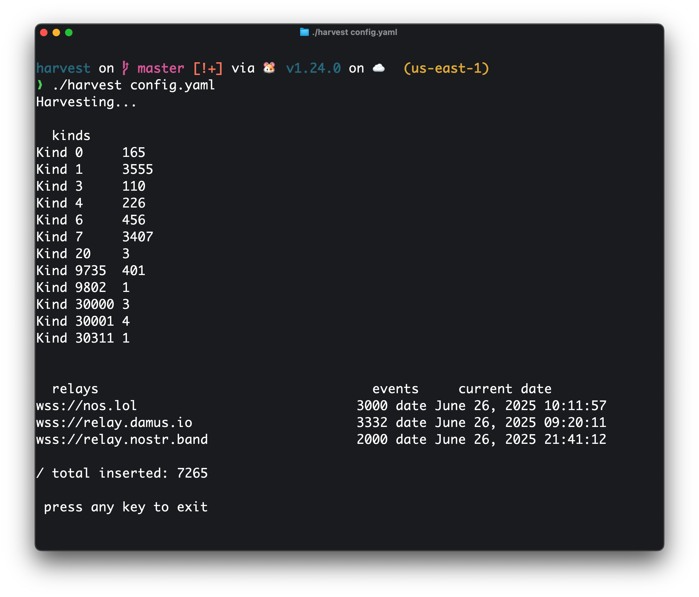

= Nostr Harvest

A small terminal ui app to harvest data from nostr relays

.demo

config.yaml

[source,yaml]
----
relays:
    - url: "wss://nos.lol"
      until: "June 27, 2025 02:46:41"
      interval: 1
    - url: "wss://relay.damus.io"
      until: "June 27, 2025 02:04:55"
      interval: 1
    - url: "wss://relay.nostr.band"
      until: "June 27, 2025 11:01:23"
      interval: 1
      # others
filter:
    kinds:
        - 0
        - 1
        - 3
        - 6
        - 7
        - 17
        - 18
        - 20
        - 25
    limit: 500
----

The application will automatically update the until dates, allowing you to resume the process from where you left.
